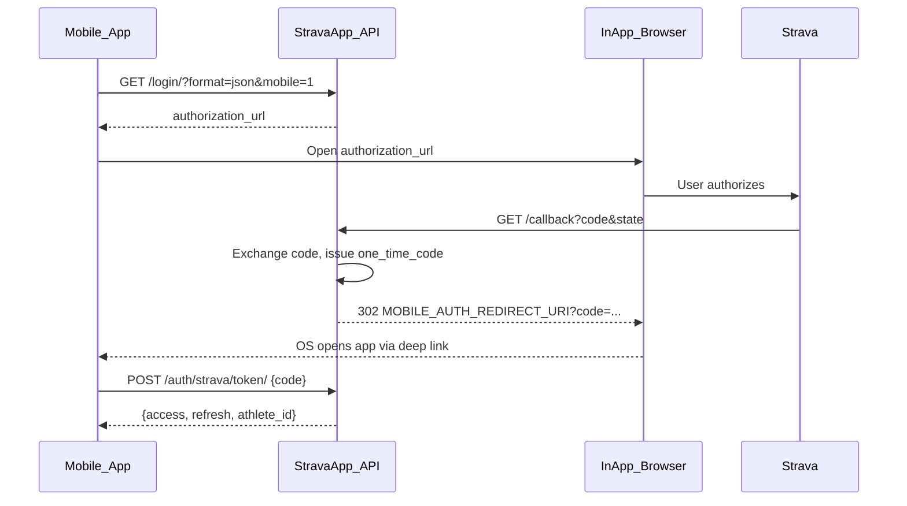

# Deep link redirect после OAuth callback

## Обзор

Добавить mobile OAuth-поток: после успешного Strava callback бэкенд редиректит на кастомный deep link с одноразовым `code`, а приложение обменивает его на JWT через новый `POST /api/auth/strava/token/`. JSON-ответ сохраняется для dev/curl при `mobile` не указан.

## Целевой поток



**Важно:** `redirect_uri` для Strava **не меняется** — по-прежнему HTTP `STRAVA_REDIRECT_URI` (см. `.env.example`). Deep link используется только как **второй** редирект после обработки на сервере.

## Ключевые решения

| Решение | Выбор |
|---------|-------|
| Передача JWT | Одноразовый `code` в deep link, не сами токены |
| Deep link URI | `MOBILE_AUTH_REDIRECT_URI` в `.env` (вы зададите свой, напр. `myapp://auth`) |
| Активация mobile-режима | Query-параметр `mobile=1` при старте login |
| Обратная совместимость | Без `mobile=1` callback по-прежнему отдаёт JSON |

### Почему одноразовый code, а не токены в URL

JWT в query string попадают в логи прокси, историю браузера и crash-репорты. Одноразовый code (TTL 60 с, single-use) — стандартный компромисс: deep link короткий, секреты уходят только в `POST` по HTTPS.

## Изменения в бэкенде

### 1. Настройки

В `config/settings.py` и `.env.example`:

```python
MOBILE_AUTH_REDIRECT_URI = os.environ.get('MOBILE_AUTH_REDIRECT_URI', '')
```

- Пустое значение = deep link отключён (даже с `mobile=1` вернётся 503 или JSON с ошибкой конфигурации).
- Вы задаёте свой URI, например `myapp://auth` или `com.yourapp://oauth/callback`.

### 2. Хранение OAuth state — расширить структуру

Сейчас в `strava_app/views.py`:

```python
cache.set(f'strava_oauth_state:{state}', True, timeout=600)
```

Заменить на объект:

```python
cache.set(f'strava_oauth_state:{state}', {'mobile': True}, timeout=600)
```

При `mobile=1` на login сохранять `{'mobile': True}`; иначе `{'mobile': False}`.

### 3. `strava_login` — флаг mobile

`GET /api/auth/strava/login/?format=json&mobile=1`

- `mobile=1` → в cache пишется `{'mobile': True}`.
- Без `mobile` → поведение как сейчас (JSON с `authorization_url`).

### 4. `strava_callback` — ветвление ответа

После существующей логики (exchange code → user/account → JWT) добавить:

**Успех + mobile:**

1. Сгенерировать `exchange_code = secrets.token_urlsafe(32)`.
2. Сохранить в cache на 60 с: `strava_mobile_code:{exchange_code}` → `{access, refresh, athlete_id}`.
3. `redirect(f'{MOBILE_AUTH_REDIRECT_URI}?{urlencode({"code": exchange_code})}')`.

**Успех без mobile:** текущий `Response({'athlete_id': ..., **tokens})`.

**Ошибки + mobile:** редирект на deep link с query-параметрами (не HTTP 400):

| Ситуация | Deep link |
|----------|-----------|
| Strava `error=access_denied` | `?error=access_denied` |
| Нет `code` | `?error=missing_code` |
| Невалидный `state` | `?error=invalid_state` |
| Ошибка Strava token exchange | `?error=token_exchange` |

**Ошибки без mobile:** текущие JSON-ответы без изменений.

Также добавить обработку Strava denial (`request.query_params.get('error')`) — сейчас в `strava_callback` это не обрабатывается, хотя упомянуто в `docs/MOBILE_API.md`.

### 5. Новый endpoint — обмен code на JWT

```
POST /api/auth/strava/token/
Content-Type: application/json
AllowAny

{"code": "<one_time_code>"}
```

**Успех `200`:**

```json
{"athlete_id": 12345, "access": "...", "refresh": "..."}
```

**Логика:**

- Найти `strava_mobile_code:{code}` в cache.
- Если нет / истёк → `400 {"error": "Invalid or expired code."}`.
- Удалить ключ из cache (single-use).
- Вернуть сохранённые токены.

Добавить маршрут в `strava_app/urls.py`.

### 6. Вынести helpers (опционально, но чище)

Новый файл `strava_app/oauth_mobile.py`:

- `create_exchange_code(tokens: dict) -> str`
- `consume_exchange_code(code: str) -> dict | None`
- `build_mobile_redirect(**query_params) -> str` — собирает URI с `urlencode`

Это держит `views.py` читаемым и упрощает тесты.

## Контракт для мобильного приложения

### Старт авторизации

```
GET /api/auth/strava/login/?format=json&mobile=1
```

### Перехват deep link

Зарегистрировать URL scheme из `MOBILE_AUTH_REDIRECT_URI` (iOS: `CFBundleURLSchemes`, Android: intent-filter).

Пример успеха:

```
myapp://auth?code=AbCdEf...
```

Пример ошибки:

```
myapp://auth?error=access_denied
```

### Обмен code

```http
POST /api/auth/strava/token/
{"code": "AbCdEf..."}
```

Сохранить `access` и `refresh` в secure storage, закрыть in-app browser.

### Рекомендуемый API на клиенте

- **iOS:** `ASWebAuthenticationSession` с `callbackURLScheme` = scheme из URI (например `myapp`).
- **Android:** Custom Tabs + intent-filter на scheme/host/path.
- **React Native:** `expo-linking` / `Linking.addEventListener` + `expo-web-browser`.

Больше **не нужно** делать `fetch` на HTTP callback URL и парсить JSON из WebView.

## Документация

Обновить:

- `docs/MOBILE_API.md` — новый recommended flow, sequence diagram, убрать строку «Deep link not implemented», описать error query params.
- `README.md` — кратко: `MOBILE_AUTH_REDIRECT_URI`, `mobile=1`, `POST /api/auth/strava/token/`.

## Тесты

В `strava_app/tests.py` (сейчас пустой):

1. Login с `mobile=1` сохраняет mobile flag в cache (mock cache).
2. Callback с mobile → 302 на deep link с `code`, JSON не возвращается.
3. `POST /token/` с валидным code → JWT; повторный запрос → 400.
4. Callback без mobile → JSON как раньше.
5. Callback mobile + `error=access_denied` → deep link с `error=access_denied`.

## Чеклист реализации

- [ ] Добавить `MOBILE_AUTH_REDIRECT_URI` в `settings.py` и `.env.example`
- [ ] Создать `strava_app/oauth_mobile.py`: exchange code create/consume, build redirect URL
- [ ] Расширить `strava_login`: `mobile=1` сохраняет флаг в OAuth state cache
- [ ] Обновить `strava_callback`: deep link redirect / error redirect / JSON fallback
- [ ] Добавить `POST /api/auth/strava/token/` и маршрут в `urls.py`
- [ ] Обновить `MOBILE_API.md` и `README.md` под новый поток
- [ ] Написать тесты для mobile redirect, token exchange и backward compatibility

## Что нужно перед реализацией

Указать точное значение `MOBILE_AUTH_REDIRECT_URI` в `.env`, например:

- `myapp://auth`
- `stravaapp://oauth/callback`

Scheme должен совпадать с регистрацией в мобильном приложении.

## Ограничения / out of scope

- Rate limiting на `/token/` — не в этом PR.
- HTTPS — отдельная задача (для prod обязателен на API).
- Universal Links (https://) вместо custom scheme — можно добавить позже, меняется только `MOBILE_AUTH_REDIRECT_URI`.
