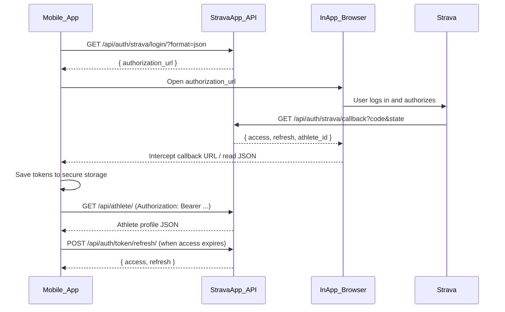

# StravaApp Mobile API Documentation

This document describes how a mobile client (iOS / Android / React Native / Flutter) should integrate with the StravaApp backend.

## Base URL

```
http://13.51.255.182:8080
```

All API paths are prefixed with `/api/`.

> **Production note:** The server currently runs over HTTP on a public IP. For App Store / Play Store release, migrate to HTTPS with a real domain (e.g. `api.altfitx.com`).

---

## Authentication Overview

The backend uses a two-layer token model:

| Token | Issued by | Used by mobile client? | Purpose |
|-------|-----------|------------------------|---------|
| **JWT access token** | StravaApp backend | **Yes** | Authenticate API requests (60 min lifetime) |
| **JWT refresh token** | StravaApp backend | **Yes** | Obtain new access token without re-login (30 days) |
| Strava access/refresh token | Strava | **No** | Stored server-side; backend uses them to call Strava API |

The mobile app never sees or stores Strava tokens directly.

### Auth flow summary

```
Mobile App
  → GET /api/auth/strava/login/?format=json     (get Strava authorization URL)
  → Open URL in in-app browser (WebView / ASWebAuthenticationSession)
  → User authorizes on Strava
  → Strava redirects to backend callback
  → Mobile app intercepts callback URL and reads JWT from JSON response
  → Store access + refresh tokens securely
  → Use access token: Authorization: Bearer <access>
  → When access expires: POST /api/auth/token/refresh/
```

---

## Endpoints

### 1. Start Strava authorization

**Request**

```
GET /api/auth/strava/login/?format=json
```

| Parameter | Required | Description |
|-----------|----------|-------------|
| `format=json` | **Yes for mobile** | Returns JSON instead of HTTP redirect |

No authentication required.

**Success response `200 OK`**

```json
{
  "authorization_url": "https://www.strava.com/oauth/authorize?client_id=31927&response_type=code&redirect_uri=http%3A%2F%2F13.51.255.182%3A8080%2Fapi%2Fauth%2Fstrava%2Fcallback&approval_prompt=auto&scope=read&state=<random_state>"
}
```

**Mobile action:** Open `authorization_url` in an in-app browser session.

**Important:**
- The `state` parameter is generated server-side and stored in cache for 10 minutes.
- Do not modify the `authorization_url`.
- Do not request a new login URL while an authorization session is in progress.

---

### 2. OAuth callback (handled by backend, intercepted by mobile)

After the user authorizes on Strava, Strava redirects to:

```
GET /api/auth/strava/callback?code=<authorization_code>&state=<state>&scope=read
```

This endpoint is called by Strava, not directly by the mobile app. The mobile app must **intercept** this redirect inside the in-app browser.

**Success response `200 OK`**

```json
{
  "athlete_id": 3226679,
  "access": "eyJhbGciOiJIUzI1NiIsInR5cCI6IkpXVCJ9...",
  "refresh": "eyJhbGciOiJIUzI1NiIsInR5cCI6IkpXVCJ9..."
}
```

| Field | Type | Description |
|-------|------|-------------|
| `access` | string | JWT access token — use in `Authorization: Bearer` header (expires in 60 min) |
| `refresh` | string | JWT refresh token — use to obtain new access token (expires in 30 days) |
| `athlete_id` | integer | Strava athlete ID |

**Mobile action after success:**
1. Close the in-app browser.
2. Save `access` and `refresh` to secure storage (iOS Keychain / Android EncryptedSharedPreferences).
3. Optionally save `athlete_id` for display purposes.

**Error responses**

| Status | Body | Cause |
|--------|------|-------|
| `400` | `{"error": "Missing authorization code."}` | No `code` in callback URL |
| `400` | `{"error": "Invalid OAuth state."}` | `state` expired, reused, or login URL was regenerated |
| `502` | `{"error": "Failed to obtain Strava token: ..."}` | Strava token exchange failed |

---

### 3. Get athlete profile

**Request**

```
GET /api/athlete/
Authorization: Bearer <access_token>
```

Authentication required.

**Success response `200 OK`**

```json
{
  "id": 3226679,
  "username": "jdoe",
  "firstname": "John",
  "lastname": "Doe",
  "city": "London",
  "state": null,
  "country": "United Kingdom",
  "sex": "M",
  "premium": false,
  "summit": false,
  "created_at": "2014-01-01T00:00:00Z",
  "updated_at": "2024-06-15T12:00:00Z",
  "badge_type_id": 0,
  "weight": 75.5,
  "profile_medium": "https://dgalywyr863hv.cloudfront.net/pictures/athletes/.../medium.jpg",
  "profile": "https://dgalywyr863hv.cloudfront.net/pictures/athletes/.../large.jpg",
  "follower_count": 10,
  "friend_count": 20,
  "measurement_preference": "feet",
  "ftp": null
}
```

All fields except `id` may be `null` depending on athlete privacy settings.

**Error responses**

| Status | Body | Cause |
|--------|------|-------|
| `401` | `{"detail": "Authentication credentials were not provided."}` | Missing `Authorization` header |
| `401` | `{"detail": "Given token not valid for any token type"}` | Access token expired or invalid — refresh or re-login |
| `404` | `{"error": "Strava account not connected."}` | User has no linked Strava account |
| `401` | `{"error": "Strava access token is invalid or expired."}` | Server-side Strava token issue |
| `429` | `{"error": "Strava rate limit exceeded."}` | Too many Strava API calls |
| `502` | `{"error": "Strava API error: ..."}` | Strava API unavailable |

---

### 4. Refresh access token

**Request**

```
POST /api/auth/token/refresh/
Content-Type: application/json

{
  "refresh": "<refresh_token>"
}
```

No `Authorization` header required.

**Success response `200 OK`**

```json
{
  "access": "eyJhbGciOiJIUzI1NiIsInR5cCI6IkpXVCJ9...",
  "refresh": "eyJhbGciOiJIUzI1NiIsInR5cCI6IkpXVCJ9..."
}
```

> When refresh token rotation is enabled, a new `refresh` token is also returned. Always replace the stored refresh token with the new one.

**Error responses**

| Status | Body | Cause |
|--------|------|-------|
| `401` | `{"detail": "Token is invalid or expired"}` | Refresh token expired or blacklisted — re-login via Strava |

**Mobile action:** Call this when API returns `401` on access token. Update stored `access` (and `refresh` if returned).

---

### 5. Logout

**Request**

```
POST /api/auth/logout/
Authorization: Bearer <access_token>
Content-Type: application/json

{
  "refresh": "<refresh_token>"
}
```

**Success response `200 OK`**

```json
{
  "detail": "Successfully logged out."
}
```

**Error responses**

| Status | Body | Cause |
|--------|------|-------|
| `400` | `{"error": "Refresh token is required."}` | Missing `refresh` in body |
| `400` | `{"error": "Invalid refresh token."}` | Refresh token already blacklisted or malformed |

**Mobile action:** Clear stored tokens locally after successful logout.

---

## Mobile Integration Guide

### Recommended: WebView / in-app browser with URL interception

This works with the current API without backend changes.

#### Step-by-step

```
1. Call GET /api/auth/strava/login/?format=json
2. Extract authorization_url from response
3. Open authorization_url in in-app browser
4. Monitor navigation URL on every page load / redirect
5. When URL contains "/api/auth/strava/callback":
     a. Make HTTP GET to that full URL (or read response body from WebView)
     b. Parse JSON: { access, refresh, athlete_id }
     c. Save access + refresh to secure storage
     d. Close in-app browser
     e. Navigate to authenticated home screen
6. For all API calls, add header:
     Authorization: Bearer <access>
7. On 401 — call POST /api/auth/token/refresh/ with stored refresh token
8. On logout — call POST /api/auth/logout/ and clear local tokens
```

#### Callback URL pattern to intercept

```
http://13.51.255.182:8080/api/auth/strava/callback?code=...&state=...&scope=read
```

Match on path `/api/auth/strava/callback` (with or without trailing slash).

---

### Platform-specific recommendations

#### iOS (Swift)

Use `ASWebAuthenticationSession` or `SFSafariViewController`.

```swift
// Pseudocode
let loginURL = URL(string: "\(baseURL)/api/auth/strava/login/?format=json")!
let (data, _) = try await URLSession.shared.data(from: loginURL)
let response = try JSONDecoder().decode(LoginResponse.self, from: data)

// Open response.authorization_url in ASWebAuthenticationSession
// On redirect to callback URL — fetch the URL and parse access + refresh tokens
```

Store `access` and `refresh` in **Keychain**.

#### Android (Kotlin)

Use **Chrome Custom Tabs** or **WebView** with `WebViewClient.shouldOverrideUrlLoading`.

```kotlin
// Pseudocode
if (url.contains("/api/auth/strava/callback")) {
    val response = httpClient.get(url)
    encryptedPrefs.edit()
        .putString("access_token", response.access)
        .putString("refresh_token", response.refresh)
        .apply()
    closeWebView()
}
```

Store tokens in **EncryptedSharedPreferences**.

#### React Native

Use `react-native-webview` or `expo-web-browser` + `expo-auth-session`.

```javascript
const API_BASE = 'http://13.51.255.182:8080';

async function loginWithStrava() {
  const res = await fetch(`${API_BASE}/api/auth/strava/login/?format=json`);
  const { authorization_url } = await res.json();

  const onNavigationStateChange = async (navState) => {
    if (navState.url.includes('/api/auth/strava/callback')) {
      const callbackRes = await fetch(navState.url);
      const { access, refresh, athlete_id } = await callbackRes.json();
      await SecureStore.setItemAsync('access_token', access);
      await SecureStore.setItemAsync('refresh_token', refresh);
    }
  };
}

async function refreshAccessToken(refresh) {
  const res = await fetch(`${API_BASE}/api/auth/token/refresh/`, {
    method: 'POST',
    headers: { 'Content-Type': 'application/json' },
    body: JSON.stringify({ refresh }),
  });
  const data = await res.json();
  await SecureStore.setItemAsync('access_token', data.access);
  if (data.refresh) {
    await SecureStore.setItemAsync('refresh_token', data.refresh);
  }
  return data.access;
}
```

---

## Authenticated requests

All protected endpoints require this header:

```
Authorization: Bearer <access_token>
```

Example:

```bash
curl -H "Authorization: Bearer <access_token>" \
  http://13.51.255.182:8080/api/athlete/
```

### Token lifecycle

| Property | Value |
|----------|-------|
| Access token lifetime | 60 minutes |
| Refresh token lifetime | 30 days |
| Refresh rotation | New refresh token issued on each refresh; old one blacklisted |
| Re-login | Same Strava athlete → same Django user → new JWT pair |
| Logout | `POST /api/auth/logout/` blacklists refresh token |
| Storage | Store both tokens securely; treat refresh token like a password |

---

## Error handling checklist

| Scenario | HTTP status | Mobile app action |
|----------|-------------|-------------------|
| No token stored | — | Show login screen |
| `401` on API call | 401 | Try `POST /api/auth/token/refresh/` |
| Refresh also fails | 401 | Clear tokens, show login screen |
| `Invalid OAuth state` | 400 | Restart login from step 1 |
| User denied Strava access | redirect with `?error=access_denied` | Show "Authorization denied" message |
| Network error | — | Show retry UI |
| Strava rate limit | 429 | Show "Try again later" |

---

## Strava OAuth details (reference)

These are configured server-side; mobile app does not need Strava credentials.

| Setting | Value |
|---------|-------|
| Strava Client ID | `31927` |
| OAuth scope | `read` |
| Redirect URI | `http://13.51.255.182:8080/api/auth/strava/callback` |
| Strava authorize URL | `https://www.strava.com/oauth/authorize` |

---

## Current limitations

The following are **not yet implemented** on the backend. Mobile app should be aware:

| Feature | Status | Workaround |
|---------|--------|------------|
| `POST /api/auth/strava/token/` (send code directly) | Not implemented | Use WebView URL interception |
| Deep link redirect (`myapp://auth?token=...`) | Not implemented | Use WebView URL interception |
| Activities list endpoint | Not implemented | Only `/api/athlete/` available |
| HTTPS | Not configured | Required before production release |

---

## Sequence diagram



---

## Quick test (before building the app)

1. Get authorization URL:
   ```
   curl http://13.51.255.182:8080/api/auth/strava/login/?format=json
   ```

2. Open `authorization_url` in browser, authorize.

3. Copy `access` and `refresh` from callback JSON response.

4. Test athlete endpoint:
   ```
   curl -H "Authorization: Bearer <access>" \
     http://13.51.255.182:8080/api/athlete/
   ```

5. Test refresh:
   ```
   curl -X POST http://13.51.255.182:8080/api/auth/token/refresh/ \
     -H "Content-Type: application/json" \
     -d '{"refresh": "<refresh>"}'
   ```

---

## Contact / backend repo

- Repository: https://github.com/RomanKovalev/stravaapp
- Backend stack: Django 6 + Django REST Framework + SimpleJWT + Strava API v3
